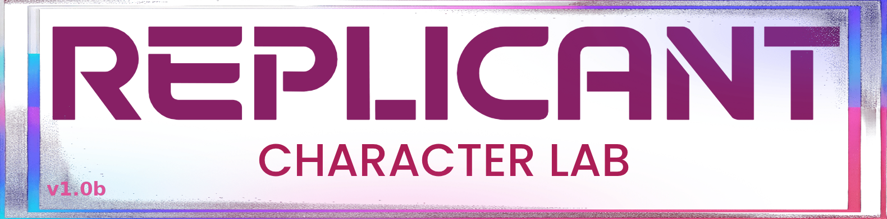

# Replicant Character Lab — Wan2GP Plugin

A [Wan2GP](https://github.com/deepbeepmeep/Wan2GP) plugin that ports the **character-creator wizard** from [SupremeDiffusion](https://github.com/saintorphan/SupremeDiffusion) into Wan2GP's Gradio UI.

## What it does

Guides you through creating a reusable character — from name + description to a trained LoRA — as a single branded tab inside Wan2GP. Seven steps:

1. **Info** — name, description, style, reference image (optional)
2. **Prompt** — positive/negative prompt generation (abliterated Qwen3.5 enhancer)
3. **Base Gen** — if reference image is not supplied, generate candidate base images, pick one — otherwise skip to #4
4. **Face / Body Swap** — optional identity locking
5. **Poses** — generate + approve pose variants
6. **Save** — write the character + build LoRA datasets
7. **Train** — train a character LoRA from the built datasets

## Status

🚧 Early development — porting the PySide6 wizard to a Gradio `WAN2GPPlugin`.

## Design notes

- Single top-level Wan2GP tab; logo banner header.
- 7-step wizard via visibility-toggled groups with a clickable step rail + Back/Next (Gradio 5.29 has no native stepper).
- Reuses portable logic from SupremeDiffusion (character schema, dataset builder/compositor, pose specs); standard generation routed through Wan2GP's native pipelines.
- Prompt enhancement via Wan2GP's abliterated Qwen3.5 enhancer.
